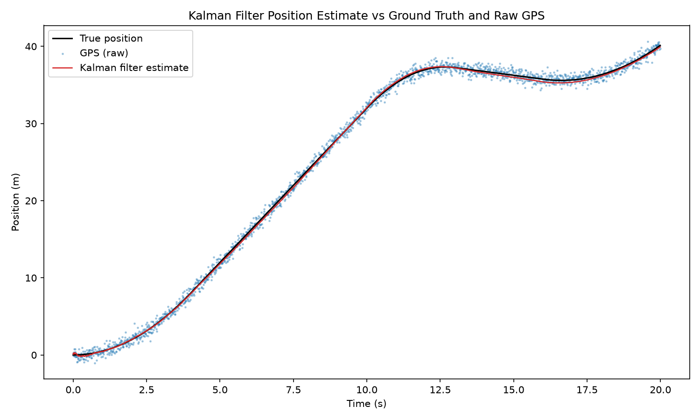

# Kalman-filter-sensor-fusion
# 1D Kalman Filter — Sensor Fusion

A Kalman filter built from scratch in Python to fuse a noisy GPS-like position sensor with a drifting IMU-like acceleration sensor, producing a position/velocity estimate that's better than either sensor alone.

## Why I built this

GPS gives you a direct position reading, but it's noisy — every reading jumps around a bit. An IMU gives you fast acceleration data, but if you integrate it over time to get position, small sensor biases accumulate and the estimate drifts away from reality. Neither sensor is good enough on its own, but a Kalman filter can combine them intelligently, trusting each one more or less depending on how reliable it currently is.

I wanted to actually implement this from the ground up rather than just use a library, so I could understand what each matrix in the filter is doing and why, not just copy the equations.

## How it works

The filter tracks two things: position and velocity. Velocity isn't measured directly by either sensor, but the filter needs to keep track of it internally to make good predictions.

Every timestep, it does two things:

1. **Predict** — using the IMU acceleration reading, it projects the state forward using basic kinematics. This step is fast but drifts over time, since the IMU has a slowly wandering bias.
2. **Update** — when a GPS reading comes in, it pulls the prediction back toward the GPS measurement, weighted by how much it currently trusts the prediction versus the measurement (the Kalman gain).

The GPS doesn't drift long-term, so it's what keeps the filter

Project Structure 

src/
├── simulate_truth.py # generates a ground truth trajectory (piecewise-constant acceleration)
├── plot_truth.py # plots the ground truth
├── simulate_sensors.py # simulates noisy GPS + drifting IMU readings from the truth
├── plot_sensors.py # plots sensor readings against the truth
├── kalman_filter.py # the filter itself (predict/update)
└── run_filter.py # runs the filter over the simulated data, compares to GPS-only, saves a plot
results/
└── kalman_filter_result.png


## Results

Here's the filter estimate against ground truth and raw GPS:



|                      | GPS-only | Kalman filter |
|----------------------|----------|----------------|
| Mean absolute error  | 0.393 m  | 0.162 m        |
| Max absolute error   | 1.926 m  | 0.355 m        |

The filter cuts average error roughly in half and handles GPS's worst-case noise spikes much better than raw GPS alone.

## Running it

```bash
# from src/
python simulate_truth.py
python plot_truth.py
python simulate_sensors.py
python plot_sensors.py
python run_filter.py
```

Needs `numpy` and `matplotlib`.

## Setup

```bash
python -m venv venv
venv\Scripts\Activate.ps1   # Windows PowerShell
pip install numpy matplotlib
```

## Some design decisions worth mentioning

- The motion model matrices (`F`, `B`) come directly from basic kinematics equations, not copied from a textbook — each row of `F` maps to `pos += vel*dt` or `vel` staying the same.
- The process noise `Q` isn't just the IMU's noise spec — since acceleration isn't a state variable itself, its uncertainty has to be propagated through the same `B` matrix that maps acceleration into position/velocity error.
- GPS is currently sampled at the same rate as the IMU, mainly to keep the first version simple. Real GPS updates much slower than an IMU, so that's a natural next step.

## What I'd add next

- Compare against a pure IMU-only estimate (no GPS correction at all) to make the drift problem visible
- Slower, more realistic GPS update rate, with the filter still predicting every IMU tick
- Some tuning experiments — seeing how the filter's behavior changes as I adjust how much it trusts each sensor